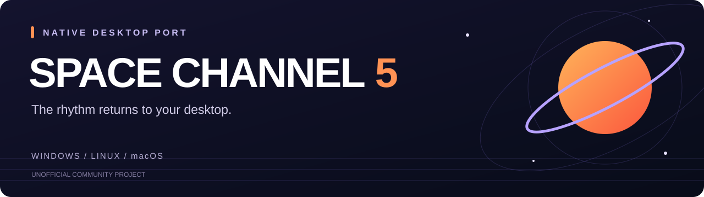

# Space Channel 5 · Native

**The rhythm returns to your desktop.**

An unofficial native port of the USA Dreamcast release, with configurable controls, display options and compiler-free downloads.

[Download](#download) · [Quick start](#quick-start) · [Features](#features) · [Controls](#controls) · [FAQ](#faq) · [Development](#development)

> **Bring your own disc.** You need the supported USA Dreamcast GDI and all its track files. Downloads include precompiled native modules, but no original disc assets. No Python, Git or compiler is needed to play.

## Download

| Platform | Download | Validation |
|---|---|---|
| Windows · x64 | [Windows ZIP][windows] | Gameplay and regression tested |
| Linux · x64 | [Linux x64 archive][linux-x64] | Build and runtime checks passed |
| Linux · ARM64 | [Linux ARM64 archive][linux-arm] | Build and runtime checks passed |
| macOS · Apple Silicon | [macOS ARM64 ZIP][mac-arm] | Build and runtime checks passed |
| macOS · Intel | [macOS Intel ZIP][mac-x64] | Build and runtime checks passed |

[Release notes, checksums and corresponding source][release] · [All releases](https://github.com/ZoomiesZaggy/Space-Channel-5/releases)

This is a **preview release**. Linux and macOS still need hands-on gameplay, graphics, audio and controller testing. macOS apps are ad-hoc signed, not notarized. See [platform details](PLATFORM-STATUS.md).

## Quick start

1. **Download and extract** the archive for your computer.
2. **Open SpaceChannel5** — `SpaceChannel5.exe` on Windows, `SpaceChannel5` on Linux, or `SpaceChannel5.app` on macOS.
3. **Select your USA GDI**, keeping its track files together, then choose **Play**. The launcher validates and imports the required files automatically.

Keep the disc files available during play: music, video and other assets are read from them. The original files remain read-only. Configure display, audio and controls in the launcher; settings apply on the next game launch.

### What you need

- A supported USA Dreamcast GDI with all of its tracks.
- A computer matching the download’s architecture and a working OpenGL 3.3-capable graphics driver.
- Keyboard or an SDL-compatible game controller.

Minimum CPU/RAM specifications and older operating-system compatibility have not been established. The [player guide](PLAYER-GUIDE.md) covers configuration and saves.

## Features

### Native gameplay

The game’s SH4 code is translated ahead of time into native modules. Gameplay does not use an SH4 interpreter or dynamic-recompiler fallback. Flycast provides the device, rendering and audio components.

### Choose your picture

Keep the original 4:3 framing, fit it inside a widescreen window, crop to fill, stretch, or try **expanded 16:9 geometry**. Original framing is the default. Expanded geometry is experimental; prerecorded backgrounds remain 4:3, and game-side object culling can limit what appears at the edges.

### Optional smoother motion

Geometry interpolation adds intermediate presentations with a **60 Hz target**, while game logic, input and music keep their original timing. It is off by default, can add about 17 ms of visual delay, and falls back when geometry cannot be matched. Prerecorded video retains its original cadence.

### Controls and rhythm settings

Remap keyboard and controller actions, adjust volume and audio buffering, and set a manual rhythm timing offset. Steam Input can translate Steam Controller inputs when the game is launched through Steam.

### Texture packs and native mods

Optional texture replacement and an experimental native mod interface are available. See [texture pack instructions](PLAYER-GUIDE.md#texture-packs) and the [native mod API](NATIVE-MODS.md).

## Controls

| Action | Default keyboard input |
|---|---|
| Start / pause | Enter |
| Directions | Arrow keys |
| Shoot / Dreamcast A | Z or Space |
| Rescue / back / Dreamcast B | X or Backspace |
| Dreamcast X | A |
| Dreamcast Y | S |

For Steam Controller on Windows, add `build/sc5-native-dev.exe` as a non-Steam game, enable Steam Input with a gamepad layout, and launch through Steam. Supply the disc path in saved settings or with `--gdi "X:\path\Space Channel 5 (USA).gdi"`. See [the player guide](PLAYER-GUIDE.md) for remapping and calibration.

## FAQ

### Do I need to build the game myself?

No. Use a download above. The launcher imports supported files from your disc without compiling code. The source build tools are for developers.

### Which version is supported?

The supported USA Dreamcast revision in GDI format. The importer checks executable hashes and rejects unsupported data. Other regions, revisions and disc formats are not currently supported by the importer.

### Where are my saves and settings?

| Platform | Data location |
|---|---|
| Windows download | `userdata/` beside the launcher |
| Linux download | `$XDG_DATA_HOME/SpaceChannel5/userdata/`, or `~/.local/share/SpaceChannel5/userdata/` |
| macOS download | `~/Library/Application Support/SpaceChannel5/userdata/` |

Back up and preserve `userdata` when updating. Imported assets and personal data are not included in release archives.

### Does this support arbitrary refresh rates or fully widescreen video?

No. Interpolation currently targets 60 Hz geometry presentation. The original prerecorded backgrounds remain 4:3; the display modes offer different ways to present them.

### How much has been tested?

Earlier Windows assist-mode validation completed all four reports, credits and return to title. The desktop preview passed 64 Windows native regression tests, matched gameplay-state/audio replays, and a fresh compiler-free import/boot test. Isolated default and interpolated audio tests had zero underruns. This is not an exhaustive manual playthrough or a physical input-latency measurement. [Read the validation results](DESKTOP-VALIDATION.md).

## Known limitations and support

Expanded geometry and interpolation are experimental. Occasional frame gaps remain. Linux/macOS hardware playtesting and broader PC compatibility testing are still needed. The [roadmap](ROADMAP.md) tracks further work.

If something goes wrong, [open an issue](https://github.com/ZoomiesZaggy/Space-Channel-5/issues/new/choose) with the release version, operating system, graphics hardware, input device and steps to reproduce it. Review logs before attaching them; do not upload disc images, extracted game files or private saves.

## Development

- [Build from source](BUILDING.md)
- [Contribute or report a bug](CONTRIBUTING.md)
- [Platform implementation and testing](PLATFORM-STATUS.md)
- [Native mod interface](NATIVE-MODS.md)
- [Performance notes](PERFORMANCE-NOTES.md) and [release validation](DESKTOP-VALIDATION.md)
- [Roadmap](ROADMAP.md)

## Credits and licensing

This project builds on [Flycast](https://github.com/flyinghead/flycast) for device, rendering and audio support, and the bundled Dreamcast-Forge decoder and supporting tools. Their contributors’ work and license notices are retained in this repository.

Flycast-derived components are **GPL-2.0-or-later**; Dreamcast-Forge retains its MIT license. See [source provenance](SOURCE-PROVENANCE.md), [LICENSE](LICENSE), and the notices under `licenses/` and `prototype/Dreamcast-Forge/LICENSE`.

Space Channel 5 belongs to its respective rights holders. This is an unofficial project, not affiliated with or endorsed by Sega. Original game assets are supplied by the player and are not distributed here.

[release]: https://github.com/ZoomiesZaggy/Space-Channel-5/releases/tag/v0.1.0-preview.1
[windows]: https://github.com/ZoomiesZaggy/Space-Channel-5/releases/download/v0.1.0-preview.1/SpaceChannel5-v0.1.0-preview.1-Windows-X64.zip
[linux-x64]: https://github.com/ZoomiesZaggy/Space-Channel-5/releases/download/v0.1.0-preview.1/SpaceChannel5-v0.1.0-preview.1-Linux-X64.tar.gz
[linux-arm]: https://github.com/ZoomiesZaggy/Space-Channel-5/releases/download/v0.1.0-preview.1/SpaceChannel5-v0.1.0-preview.1-Linux-ARM64.tar.gz
[mac-arm]: https://github.com/ZoomiesZaggy/Space-Channel-5/releases/download/v0.1.0-preview.1/SpaceChannel5-v0.1.0-preview.1-macOS-ARM64.zip
[mac-x64]: https://github.com/ZoomiesZaggy/Space-Channel-5/releases/download/v0.1.0-preview.1/SpaceChannel5-v0.1.0-preview.1-macOS-X64.zip
